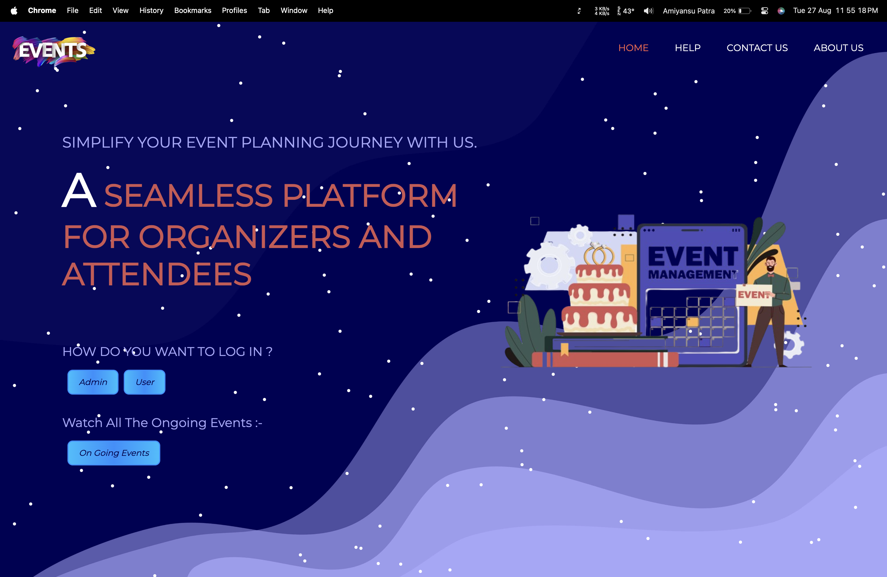
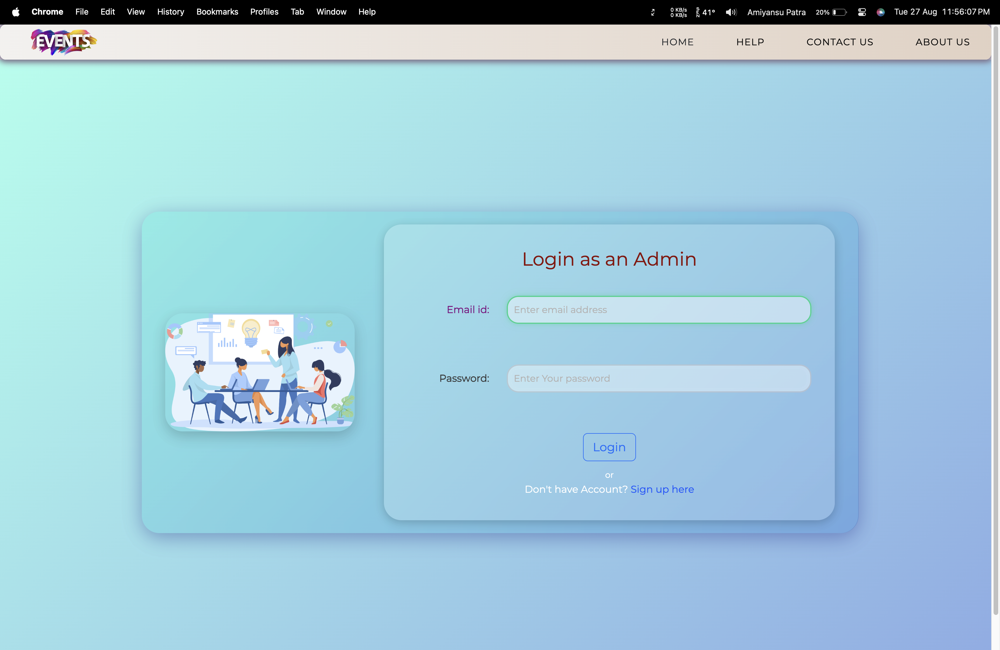

    <h1>NGO Event Management System (MERN Stack)</h1>

    

        This is a fully functional <strong>Event Management System</strong> designed specifically for NGOs, built using
        the MERN stack. It allows NGOs to manage events, view upcoming and previous events, and update their profile
        information.
    

        
        
    

    <h2>Project Overview</h2>

    
The system consists of two main components:

    <ul>
        <li><strong>Frontend:</strong> Built with React.js, utilizing Material UI, Ant Design, and Bootstrap for
            styling, alongside Google Maps integration for event locations.</li>
        <li><strong>Backend:</strong> Powered by Node.js and Express, with MongoDB as the database to store event
            details and user information.</li>
    </ul>

    <h2>Key Features</h2>
    <ul>
        <li><strong>User Authentication:</strong> Login and registration system for NGOs using JWT for secure
            authentication.</li>
        <li><strong>Event Management:</strong> Add, view, and update events for your NGO.</li>
        <li><strong>Previous and Upcoming Events:</strong> View past events and current/upcoming events categorized
            separately.</li>
        <li><strong>Google Maps Integration:</strong> Shows event locations on Google Maps.</li>
        <li><strong>File Uploads:</strong> Allows users to upload images and files using Multer.</li>
        <li><strong>Data Validation:</strong> Ensures data integrity and security with Validator.</li>
        <li><strong>Responsive UI:</strong> Fully responsive UI built with Material UI, Ant Design, and Bootstrap.
        </li>
    </ul>

    <h2>Project Structure</h2>

    <h3>Frontend</h3>
    <ul>
        <li><strong>React.js:</strong> Used for building the user interface.</li>
        <li><strong>Ant Design, Material UI, Bootstrap:</strong> Provides a modern, responsive design for various
            components.</li>
        <li><strong>Axios:</strong> For making HTTP requests to the backend.</li>
        <li><strong>Google Maps API:</strong> Integrated for displaying event locations on the map.</li>
    </ul>

    <h4>Key Dependencies:</h4>
    <pre>
<code>
{
  "@ant-design/icons": "^4.7.0",
  "@mui/material": "^5.4.4",
  "@react-google-maps/api": "^2.8.1",
  "axios": "^0.25.0",
  "bootstrap": "^5.1.3",
  "dotenv": "^16.0.0",
  "react": "^18.3.1",
  "react-bootstrap": "^2.1.2",
  "react-router-dom": "^5.3.0",
  "validator": "^13.7.0"
}
</code>
</pre>

    <h3>Backend</h3>
    <ul>
        <li><strong>Express.js:</strong> Backend server handling API requests.</li>
        <li><strong>MongoDB:</strong> NoSQL database to store event data and user information.</li>
        <li><strong>JWT:</strong> Used for user authentication and maintaining sessions.</li>
        <li><strong>Multer:</strong> Middleware for handling file uploads.</li>
    </ul>

    <h4>Key Dependencies:</h4>
    <pre>
<code>
{
  "bcrypt": "^5.0.1",
  "body-parser": "^1.19.2",
  "cors": "^2.8.5",
  "dotenv": "^16.0.0",
  "express": "^4.17.2",
  "jsonwebtoken": "^8.5.1",
  "mongoose": "^6.2.0",
  "multer": "^1.4.4"
}
</code>
</pre>

    <h2>Installation</h2>

    
To run this project locally, follow these steps:

    <h3>Prerequisites</h3>
    <ul>
        <li>Node.js</li>
        <li>MongoDB</li>
        <li>npm (Node Package Manager)</li>
    </ul>

    <h3>Frontend Setup</h3>
    <ol>
        <li>Navigate to the <code>frontend</code> folder.</li>
        <li>Install the dependencies:
            <pre><code>npm install</code></pre>
        </li>
        <li>Start the frontend server:
            <pre><code>npm start</code></pre>
        </li>
    </ol>

    <h3>Backend Setup</h3>
    <ol>
        <li>Navigate to the <code>backend</code> folder.</li>
        <li>Install the dependencies:
            <pre><code>npm install</code></pre>
        </li>
        <li>Set up your environment variables in a <code>.env</code> file (e.g., MongoDB URI, JWT Secret).</li>
        <li>Start the backend server:
            <pre><code>npm start</code></pre>
        </li>
    </ol>

    <h2>Environment Variables</h2>

    
Create a <code>.env</code> file in your backend root directory and add the following:

    <pre>
<code>
MONGO_URI=your_mongodb_connection_string
JWT_SECRET=your_jwt_secret
PORT=9002
</code>
</pre>

    <h2>Deployment</h2>

    
For deploying the project, you can either use services like <strong>Heroku</strong>, <strong>Netlify</strong>, or
        <strong>Vercel</strong>.

    
Make sure you properly configure your environment variables and adjust the database connections accordingly.
    

    <h2>Screenshots</h2>

    

        
        
        
    

    <h2>License</h2>

    
This project is licensed under the MIT License - see the <a href="LICENSE">LICENSE</a> file for details.

    <h2>Author</h2>

    
<strong>Amiyansu Patra</strong>

    
Feel free to reach out with any questions or suggestions!

